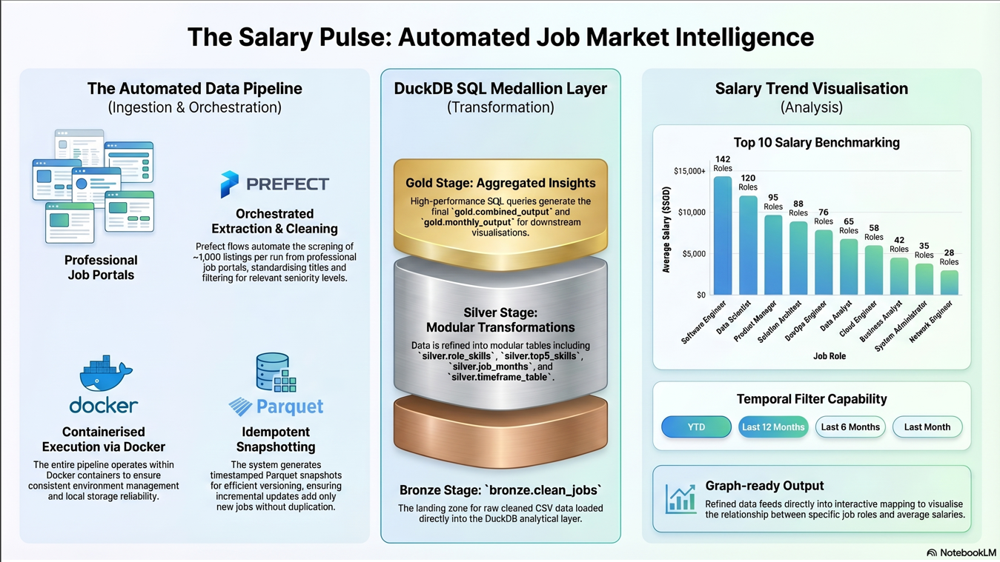
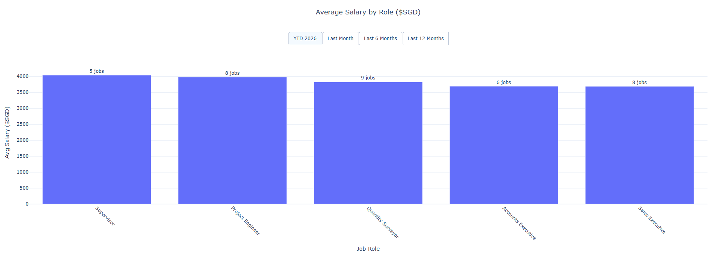

# Entry Level Job Market Data Pipeline

> A containerised data pipeline that scrapes job listings, maintains a historical dataset, and generates cleaned, analysis-ready outputs. Each pipeline run processes ~1,000 job listings and updates a continuously growing dataset.

---

## What This Project Does

This pipeline automates the full lifecycle of job market data — from raw API extraction through to refined, analysis-ready outputs. It has evolved from a simple scraper into a full analytical tool with a dedicated SQL layer for deeper insights.

| Feature | Description |
|---|---|
| ✅ Automated Data Pipeline | Scrapes job listings and processes them end-to-end using Prefect flows. |
| ✅ DuckDB Analytical Layer | Uses SQL to transform raw data into insights via a Medallion Architecture. |
| ✅ Incremental Updates | Appends only new jobs to the master dataset to avoid duplication. |
| ✅ Snapshot Versioning | Stores historical snapshots using Parquet for efficient data versioning. |
| ✅ Data Cleaning Pipeline | Standardises titles, filters relevant seniority levels, and cleans posting dates. |
| ✅ Containerised Execution | Runs entirely inside Docker for consistent environment management. |

---

## Pipeline Overview



- **Scrape Flow** — Uses `@task(retries=3, retry_delay_seconds=5)` to fetch job listings, parsing them into structured rows.
- **Clean Flow** — Performs `entry_filter` to target entry-level jobs and `remove_senior` to strip out irrelevant high-level roles.
- **SQL Transformation (Medallion Architecture)** — The raw cleaned data is fed into a DuckDB layer to move data through three stages:
  - **Bronze:** Raw cleaned CSV loaded directly into DuckDB.
  - **Silver:** Transformations involving skills extraction, timeframes, and active job months.
  - **Gold:** Aggregated outputs specifically formatted for analysis and graphing.
- **Snapshot Logic** — Automatically generates a timestamped Parquet file after each run to preserve the historical state.

---

## How to Run

Ensure you have Docker installed and a `.env` file in your root directory containing your `API_URL_1`.

**1. Build the image:**
```bash
docker build -t job-pipeline .
```

**2. Run the pipeline:**
```bash
docker run --env-file .env -v "${PWD}:/app" job-pipeline
```

This container will:
- Scrape new job listings.
- Append to an ever-expanding dataset.
- Create a snapshot of previous collated datasets.
- Generate a cleaned master file.
- Run the DuckDB layer to update the analytical database.
- Generate a `graph_ready.csv` and a Parquet snapshot.

---

## Project Structure

```text
python/
├── scraper.py           # API extraction logic
├── cleaning.py          # Filtering and formatting
├── duckdb_layer.py      # SQL transformations (Medallion Architecture)
├── run_pipeline.py      # Orchestration
db/
└── jobs.duckdb          # Local analytical database
output/
├── cleaned_jobs.csv     # Master record
├── scraped_jobs.csv     # Collation of all jobs scraped
└── graph_ready.csv      # Final visual-ready output
config.json              # Path and tool configurations
.env                     # API credentials and URLs
Dockerfile               # Environment setup
```

---

## Data Outputs

| File | Purpose |
|---|---|
| `cleaned_jobs.csv` | Cleaned master file of all jobs based on scraped entries. |
| `scraped_jobs.csv` | Collated dataset containing all historical records. |
| `jobs.duckdb` | Persistent database file for SQL-based analysis. |
| `graph_ready.csv` | Aggregated Gold-layer output used directly for visualisations. |
| `snapshot_*.parquet` | Historical versions stored in compressed format. |



---

## Key Concepts

- **Medallion Architecture** — Structured data progression from raw (Bronze) to aggregated insights (Gold).
- **SQL Transformations (DuckDB)** — Moving heavy lifting out of Pandas and into high-performance SQL for analytical queries.
- **Separation of Concerns** — Decoupling the data pipeline (gathering/cleaning) from the visualisation layer (graphing outputs).
- **ETL Pipeline Design** — Separation of extraction, transformation, and loading concerns across Prefect tasks.
- **Idempotent Appending Logic** — Re-running the scraper does not create duplicate entries in the master dataset.

---

## Limitations

- **API Dependency** — Relies on the uptime and rate limits of the external job portal API.
- **Local Storage Only** — Data is stored in the container volume or local path rather than a cloud-based warehouse.
- **Not Production Infrastructure** — Designed for localised analysis rather than enterprise-scale processing.
